# Hi — I'm 0xHI50kA 👋

  

> _“The Matrix isn’t just a movie — it’s a mindset.”_

---

## 💀 About Me

  

    + I craft, break, and rebuild technology. 
    + Open-source enthusiast & cybersecurity explorer. 
    + Constantly experimenting with code, exploits, and creative chaos.
  

---

## 🛠 Skills & Tech

  <!-- Languages -->
  

    <h3 style="color: #00ff99; font-family: 'Courier New', monospace;">Programming & Markup Languages</h3>
    

      
      
      
      
      
      
      
      
    

  

  <!-- Frameworks & Tools -->
  

    <h3 style="color: #00ff99; font-family: 'Courier New', monospace;">Frameworks & Tools</h3>
  

  
  
  
  
  
  

  

  <!-- Databases -->
  

    <h3 style="color: #00ff99; font-family: 'Courier New', monospace;">Databases</h3>

  <!-- MySQL (TechStack) -->
  

  <!-- MongoDB -->
  

  <!-- PostgreSQL -->
  

  <!-- Oracle -->
  

  

  <!-- Other Skills -->
  

    <h3 style="color: #00ff99; font-family: 'Courier New', monospace;">Other Skills</h3>

  
  
  

  

---

## 📊 GitHub Metrics

  <h3 style="color: #00ff99; font-family: 'Courier New', monospace; font-weight: bold; text-shadow: 0 0 12px #00ff99;">
    &gt; Top Languages
  </h3>
  

  <h3 style="color: #00ff99; font-family: 'Courier New', monospace; font-weight: bold; text-shadow: 0 0 12px #00ff99;">
     github-stats 
  </h3>
  

---

## 🎯 Future Objectives

  

    + [ ] Earn CEH (Certified Ethical Hacker) Certification 
    + [ ] Contribute to Open-Source Cybersecurity Projects 
    + [ ] Launch an AI-Powered Application for Security/Automation
  

---

## 🔗 Connect With Me

  

    [LinkedIn](https://linkedin.com/in/yourprofile) 
    [Portfolio](https://yourportfolio.com) 
    [Email](mailto:your-email@example.com)
  

